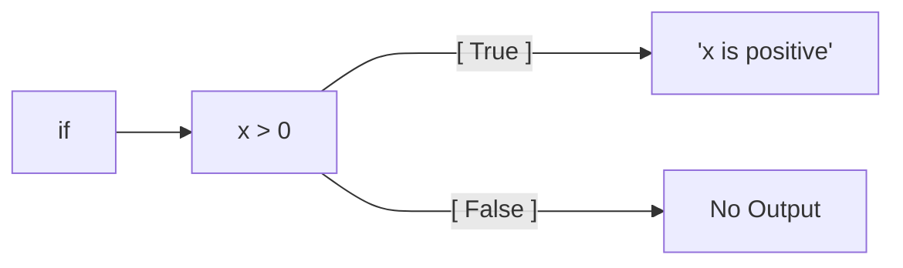
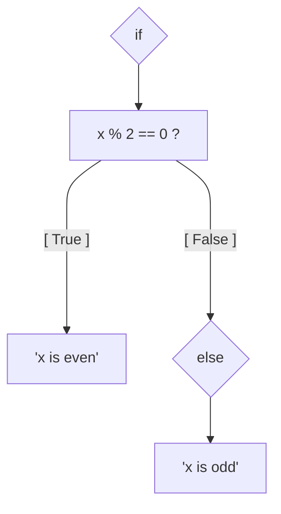

___
# Conditional Execution
___
- [x] : **Section Completed**
___
___
### Boolean Expressions 

> A **boolean expression** is an expression which is either **true** or **false** 

> The operator `==` can be used to compare two operands and produces `True` if they are equal and `false` otherwise

> True and False are **not strings** 
> > They are special values belonging to the class `bool` 

#### Comparison Operators: 

```python
x == y               # x is equal to y
x != y               # x is not equal to y
x > y                # x is greater than y
x < y                # x is less than y
x >= y               # x is greater than or equal 
					 # to y
x <= y               # x is less than or equal to y
x is y               # x is the same as y
x is not y           # x is not the same as y
```


#### Logical Operators:

> There are **3** logical operators: `and`, `or`, `not`

- **And** will execute if both conditions are met
- **Or** will execute if either conditions are met
- **Not** will reverse the boolean value of the expression

> Any **non-zero** number is interpretted as `True`

___
### Conditional Execution

> When writing programs we need to check conditions and change the behaviour of the program accordingly

eg:
```python
if x > 0:
	print('x is positive')
```



> The boolean expression which comes after the `if` statement is called the **condition**

> Statements like **If** or **For** loops must have at least one statement in their body
> > If the statement has not been written yet, the `pass` statement can be used to pass the python interpreter check

___
### Alternative Execution

> There are **2 possibilities**, the condition determines which one gets executed

```python
if x % 2 == 0:
	print('x is even')
else:
	print('x is odd')
```



> The alternatives after the `if` statement are called **branches** 

___
### Chained Conditionals

> If there are more than 2 possibilities in a situation then addition branches are required
> `elif` allows for additional checks to be made before `else` is reached

> There can be an unlimited number of `elif` statements and there doesnt have to be an `else` at the end

> Only the **first True branch** in the chain will execute

> Nested Conditionals can become difficult to read - avoid if possible

___
### Catching Exceptions (Try/Except)

> `try` / `except` is a **conditional execution structure** used to deal with expected and unexpected errors 

> If you know that a certain input or program state will break the code 
> try/except will allow you to perform additional statements in the case of an error and also prevents the program from ending ungracefully 

> If there is no error the `except` block will be ignored 

> **Important:** If aspects of the program after the `try` statement rely on information aquired within the `try` statement you will need to also quit the program within the `except` to prevent errors further down
> `quit()`


#### <u>Example:</u>

```python
inp = input('Enter Fahrenheit Temperature:')
try:
    fahr = float(inp)
    cel = (fahr - 32.0) * 5.0 / 9.0
    print(cel)
except:
    print('Please enter a number')
    quit()
```

> Python starts by executing the statements in the `try` block
> > If an exception occurs it jumps out of the `try` block and executes the statements in the `except` block instead

___
### Short-circuit Guarding Of Expressions:

eg: `x >= 2 and (x/y) > 2`
> Python will process the statement from left-->right 
> If `x >= 2` evaluates to `False` --> the rest of the statement will be ignored since the result of `x/y` will not change the overall conclusion

> If y was 0 for example and error would be produced, therefore we can place a **guard evaluation** in the statement 

```python
if x >= 2 and y != 0 and x/y > 2: 
	etc...
```

> `y != 0` will stop the rest of the statement being processed if y is equal to 0, preventing an error from occuring 

